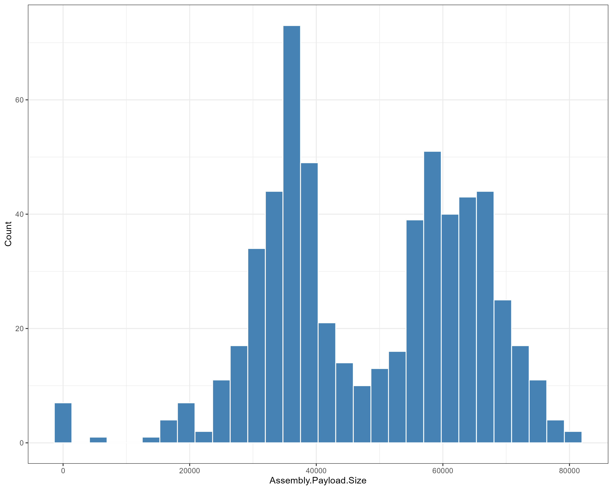
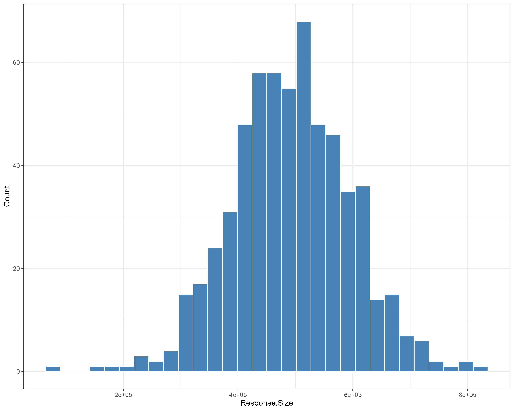
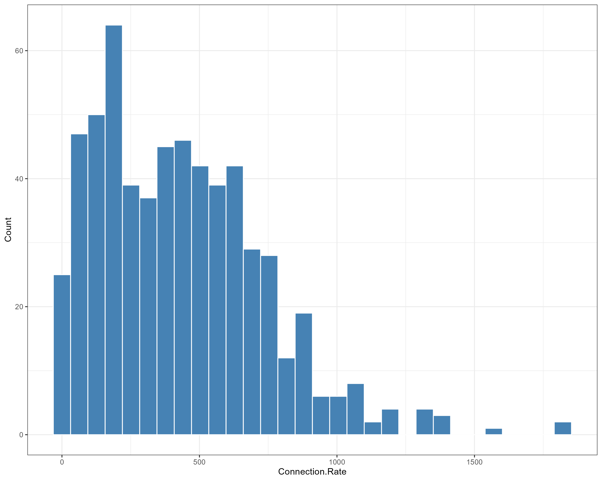
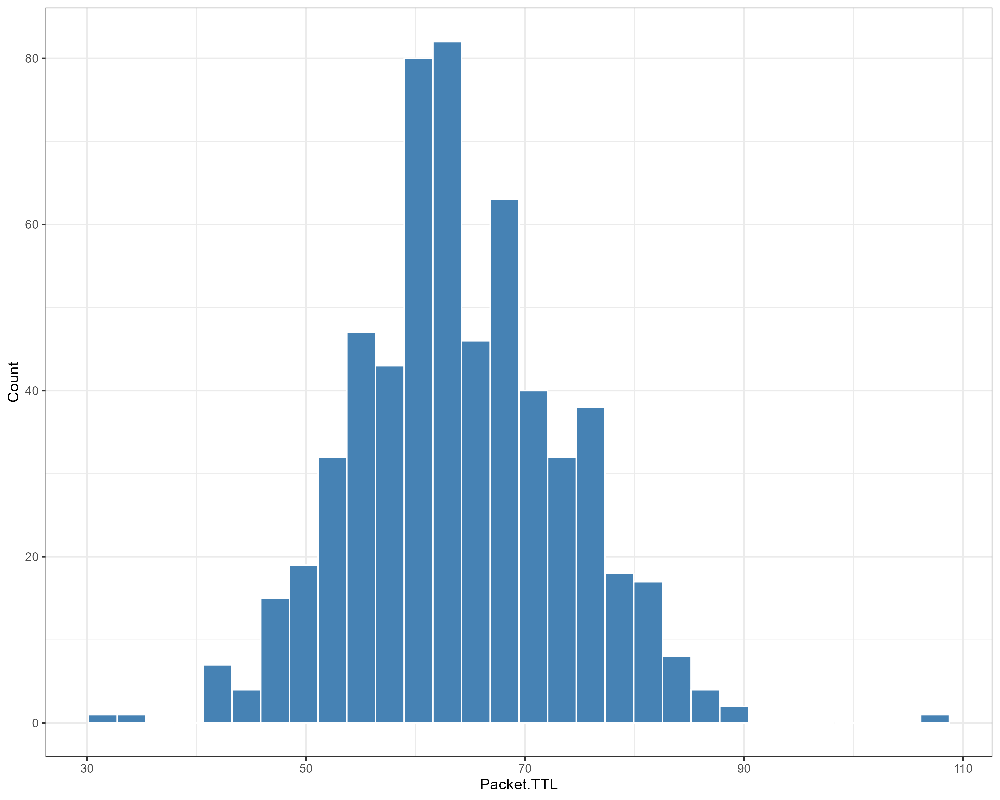
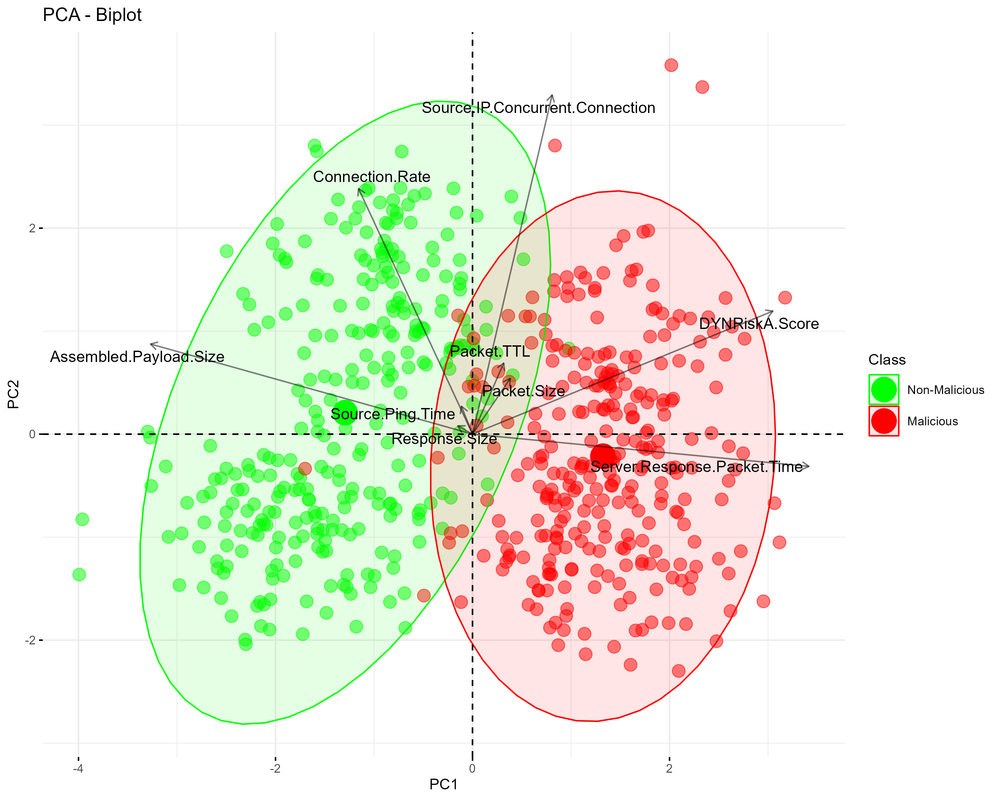
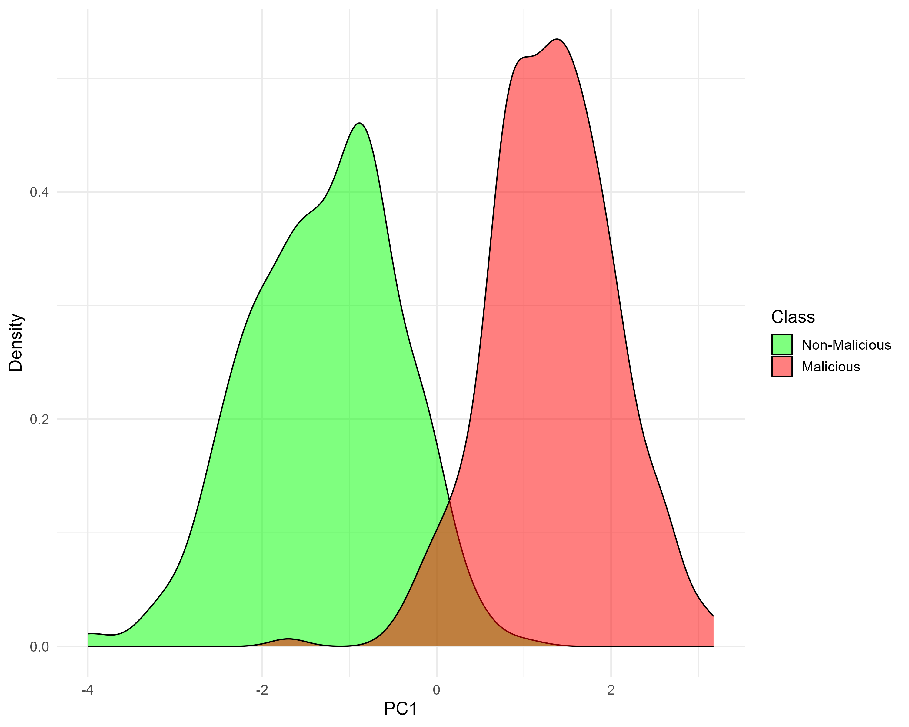
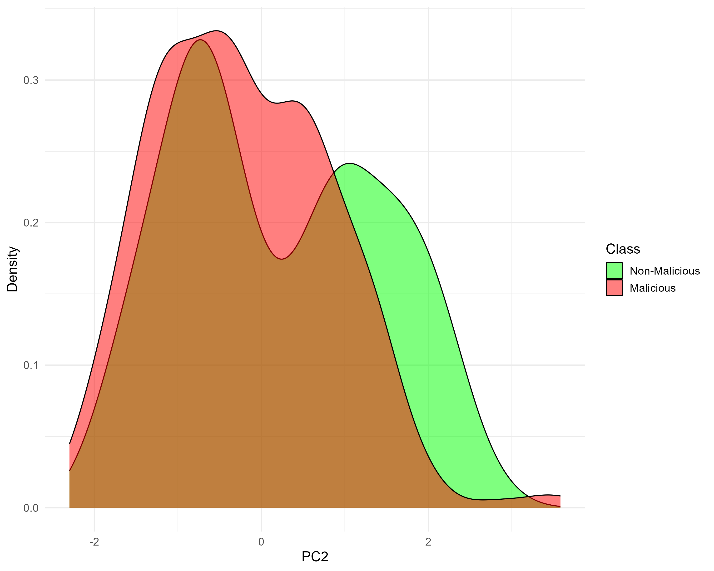

# CYB006009 - Assessment 1: Data preparation and visualisation

- [CYB006009 - Assessment 1: Data preparation and visualisation](#cyb006009---assessment-1-data-preparation-and-visualisation)
  - [Categorical \& Binary Variables](#categorical--binary-variables)
    - [Table 1 - observations](#table-1---observations)
  - [Continuous/Numerical Variables](#continuousnumerical-variables)
    - [Table 2 - observations](#table-2---observations)
      - [Outliers](#outliers)
  - [Principle Component Analysis \& Visualisation](#principle-component-analysis--visualisation)
    - [Loadings](#loadings)
      - [PC1](#pc1)
      - [PC2](#pc2)
      - [PC3](#pc3)
  - [Biplot of PC1 and PC2](#biplot-of-pc1-and-pc2)
  - [Dimension Identification](#dimension-identification)

## Categorical & Binary Variables

| Categorical Feature | Category            | N   | %     |
|:------------------- |:------------------- |:--- |:----- |
| Operating.System    | "Android"           | 238 | 39.7% |
|                     | "iOS"               | 40  | 6.7%  |
|                     | "Windows (Unknown)" | 264 | 44.0% |
|                     | "Windows 10+"       | 4   | 0.7%  |
|                     | "Windows 7"         | 54  | 9.0%  |
| Connection.State    | "ESTABLISHED"       | 397 | 66.2% |
|                     | "INVALID"           | 177 | 29.5% |
|                     | "NEW"               | 13  | 2.2%  |
|                     | "RELATED"           | 13  | 2.2%  |
| IPv6.Traffic        | "-"                 | 151 | 25.2% |
|                     | " "                 | 53  | 8.8%  |
|                     | "FALSE"             | 396 | 66.0% |
| Ingress.Router      | "mel-aus-01"        | 365 | 60.8% |
|                     | "syd-tls-04"        | 235 | 39.2% |
| Class               | "0"                 | 300 | 50.0% |
|                     | "1"                 | 300 | 50.0% |
> _Table 1 - Categorical & Binary Variables_

Table 1 shows the categorical and binary variables in the dataset. The table shows the number of observations in each category and the percentage of the total observations that category represents.

### Table 1 - observations

- The `Operating.System` variable has a category for "Windows (Unknown)", "Windows 7" and "Windows 10+". Could be combined into a single category. As the "Windows 10+" category only has 4 observations, and combining these would better identify the operating systems in the dataset by reducing the number of categories.

- The `IPv6.Traffic` variable has a category for " " and "-". Which suggests missing data. This variable should be investigated further or replaced with NA values. Alternatively, the variable could be removed from the dataset as it does not appear to be useful. False is the only category that has a significant number of observations.

- The `Connection.State` variable has categories Invalid, New and Related. We can combine these to better interpret the data where connection states are either "ESTABLISHED" or "OTHER". Identifying whether or not the connection is established or not in context of the study.

## Continuous/Numerical Variables

|Continuous Feature|Number (%) Missing|Min|Max|Mean|Median|Skewness|
|:---|:---|:---|:---|:---|:---|:---|
|Assembled.Payload.Size|7 (1.17%)|-1.00|80580.00|48476.33|49268.50|-0.28|
|DYNRiskA.Score|0(0.00%)|0.19|0.92|0.61|0.63|-0.57|
|Response.Size|0(0.00%)|76495.00|822051.00|492667.72|492937.00|-0.06|
|Source.Ping.Time|0(0.00%)|119.00|415.00|267.75|267.00|-0.04|
|Connection.Rate|0(0.00%)|0.02|1821.42|432.24|399.72|0.95|
|Server.Response.Packet.Time|0(0.00%)|75.00|417.00|226.75|221.00|0.23|
|Packet.Size|0(0.00%)|1260.00|1439.00|1349.68|1348.00|0.05|
|Packet.TTL|0(0.00%)|32.00|108.00|63.98|63.00|0.19|
|Source.IP.Concurrent.Connection|0(0.00%)|9.00|34.00|21.37|21.50|-0.03|
> _Table 2 - Continuous/Numerical Variables_

Table 2 shows the continuous/numerical variables in the dataset. The table shows the number of missing observations, the percentage of missing observations, the minimum, maximum, mean, median and skewness of each variable. Assembled payload size had 7 "-1" values which are flagged as data errors as it is not possible for an assembled payload to have a negative size.

### Table 2 - observations

- The `Assembled.Payload.Size` variable has a minimum value of -1.0. It is not possible for an assembled payload size to be negative. the skewness also points to potential outliers on the lower end.

- the `Response.Size` variable has a skewness close to 0. At -0.06, so the distribution is roughly symmetrical.

- The `Connection.Rate` variable skewness is 0.95. This suggests that there are outliers at the higher end of the distribution.
- the `Packet.TTL` variable has a skewness of 0.19. Which suggests it is fairly symmetrical. However, there are potential outliers at the upper end of the distribution.

#### Outliers

The following plots show the distribution of each variable. The plots show that there are outliers in the data. To detect and identify outliers, we use +/- 4 standard deviation. Through this we can see that outliers exist for Response.Size with 1 (76495), Connection.Rate with 2 (1820.407 & 1821.423) and Packet.TLL with 1 (108). Assembled.Payload.Size has 7 `-1` values which were not flagged as an outlier, however this is deemed to be an error as it is not possible for an assembled Payload to have a negative size.

|||
|:---|:---|
|Figure 1 - Histogram of Assembled Payload Size shows the -1 values that visually appear to be outliers.||
|Figure 2 - Histogram of Response Size showing the outliers at the lower end of the distribution. with those at the upper end also deviate from the distribution.||
|Figure 3 - Histogram of Connection Rate showing right skewed distribution, with distinct gaps at the higher end of the distribution.||
|Figure 4 - Histogram of Packet.TTL shows a roughly symmetrical distribution, with potential outliers at the lower and upper ends of the distribution with potential outliers at the lower also.||

## Principle Component Analysis & Visualisation

Standardisation was used here, as the data contained features which differed in range, units, and scale. Standardisation is necessary to ensure that the PCA does not give more weight to features with larger values and variance which could dominate the PCA. Standardisation also ensures that the PCA is not affected by the units of the features.

|Importance of components:|PC1|PC2|PC3|PC4|
|:---|:---|:---|:---|:---|
|Standard deviation|1.526|1.162|1.017|0.982|
|Proportion of Variance|0.259|0.150|0.120|0.115|
|Cumulative Proportion|0.259|0.409|0.529|0.644|
> Table 3 - shows us the individual and cumulative proportions of variance for the first 4 components

- PC1: Proportion of Variance = 0.259, Cumulative Proportion = 0.259
- PC2: Proportion of Variance = 0.150, Cumulative Proportion = 0.409
- PC3: Proportion of Variance = 0.120, Cumulative Proportion = 0.529
- PC4: Proportion of Variance = 0.115, Cumulative Proportion = 0.644

To explain at least 50% of the variability in the data, after PC1 and PC2, the cumulative proportion accounts for only 0.409, which is less than 50%. After PC3, the cumulative proportion reaches 0.529, exceeding 50%. So at least three principal components are necessary to explain at least 50% of the variability.

### Loadings

|Loadings|PC1|PC2|PC3|
|:---|:---|:---|:---|
|Assembled.Payload.Size|-0.561|0.197|0.028|
|DYNRiskA.Score|0.524|0.269|0.029|
|Response.Size|-0.026|0.018|0.747|
|Source.Ping.Time|-0.019|0.061|0.458|
|Connection.Rate|-0.199|0.538|-0.180|
|Server.Response.Packet.Time|0.586|-0.071|-0.012|
|Packet.Size|0.066|0.122|-0.343|
|Packet.TTL|0.054|0.155|0.279|
|Source.IP.Concurrent.Connection|0.139|0.743|0.053|
> Table 4 - Loadings

#### PC1

- **Assembled.Payload.Size (-0.561):** Negatively correlated with PC1 as the size of the assembled payload increases, the value of PC1 decreases.

**DYNRiskA.Score (0.524):** Positively correlated with PC1. as the DYNRiskA score increases PC1 increases.

**Server.Response.Packet.Time (0.586):** Is positively correlated with PC1. with loadings above 0.5.

#### PC2

- **Connection.Rate (0.538):** Positively correlated with PC2. as the connection rate increases, the value of PC2 tends to increase.

- **Source.IP.Concurrent.Connection (0.743):** also has a positive loading on PC2, as the number of concurrent connections from the source IP increases, the value of PC2 tends to increase.

#### PC3

- Main driver **Response.Size (0.747):** which has a positive correlation with PC3. As the response size increases, the value of PC3 tends to increase.

## Biplot of PC1 and PC2

> Figure 5 - Biplot of PC1 vs PC2

The PCA scatter plot shows a partial separation between Malicious (red) and Non-Malicious (green) events, which reveals the PCA's ability to capture key variances, although with some overlap that. The accompanying loadings plot further explains the influence of individual features, such as 'DYN Risk', whose prominent vectors signify their strong impact on principal components and possible role in differentiating between the two classes of events. The angles between these vectors reveal the correlation between features, with varying degrees of positivity and negativity. A synthesis of these plots allows us to discern that features like 'DYN Risk', which correlate with the PCA-driven class separation, are important in identifying Malicious events.

The main drivers for categorising events as Malicious or Non-Malicious:

**DYN Risk:** This feature has a significant vector in the loading plot, pointing towards the region where Malicious events are clustered in the PCA scatter plot, suggesting it is a strong indicator of potentially malicious activity.

**Packet TTL:** The presence of 'Packet TTL' in the area of the scatter plot that includes Malicious events, and its relative length in the loading plot, indicates its relevance in detecting Malicious events.

**Server.Response.PacketTTL:** Similar to 'Packet TTL', this feature's vector suggests it contributes to the identification of Malicious events.

## Dimension Identification

The following plots show the density of the data points for PC1 and PC2. We see that PC1 Offers better separation between Malicious and Non-Malicious events. PC2 on the other hand has significant overlap of malicious and non-malicious points. This suggests that PC1 is a better predictor of Malicious events than PC2.

|Figure 6: Density PC1|Figure 7: Density PC2|
|:---|:---|
|||
