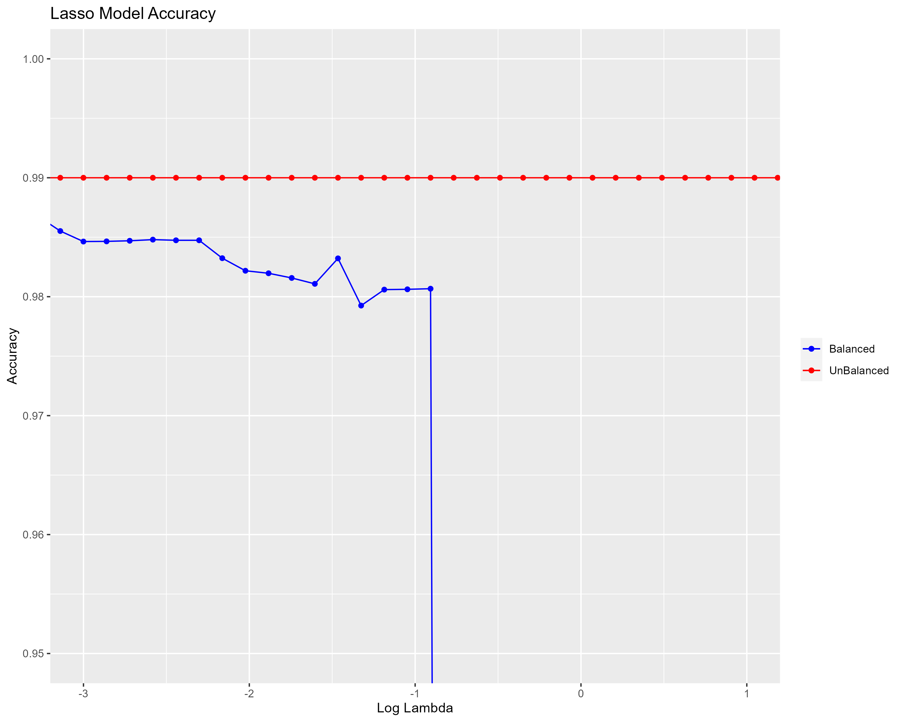

# Case Study 02

## Introduction

Disc Consulting Enterprises (DCE) aims to implement an early warning system that extends the functionality of their current Security, Information and Event Management or SIEM system. This report presents an analysis Logistic LASSO Regression & Bagging Tree machine learning models to identify the an accurate method for classifying malicious events.

The data used in this analysis is pre-processed and cleaned to subset into training and testing sets. The data preparation and cleaning process involved merging categories of operating systems and connection states, as well as filtering out Incomplete records. This step ensures the input data is of high quality and prevents any biases due to imbalanced data distribution.

The report outlines hyperparameter tuning strategies for each machine learning model based on cross validation and optimal tuning parameter values. The performance of each model is assessed using various metrics including overall accuracy, precision, recall. F-Score, False Positive rate, and False Negative Rate.

Comparative analysis of the models presents their strengths and weaknesses, and detecting malicious events based on the evaluation metrics and considering factors such as parsimony and interpretability, the report then provides a recommendation for a suitable machine learning model to integrate with the existing SIEM solution.

## Data Cleaning and Preparation

- **Assembled.Payload.Size** "-1" values were removed as the payload cannot be negative.

- **Operating.System** - Invalid values were removed, and the categories were merged into Windows_All, Other_OS and Android merging due to the low counts in the categories.

- The **Connection.state** feature was simplified by merging the categories into ESTABLISHED and OTHERS. Like the Operating.System feature, the categories were merged due to the low counts in the categories.

- For the **Class** feature the invalid values are replaced with NA. We then use factor() to convert the Class feature to a factor.

- The feature **IPv6.Traffic** was removed as it had a large proportion of invalid or bad data.

- The data set is then filtered. To only include cases with class equal to zero or one. Then selecting only completed cases using the NaOmit() function. Then written to ‘MLData2023_cleaned.csv’
- The clean data was then subset into 2 Training sets, Balanced and Unbalanced, and a Testing set. Due to the number of Malicious events representing less than 1% of events. The balanced sets utilise bootstrapping to up-sample the minority class to prevent bias to the non-malicious events. The unbalanced sets roughly maintain the original distribution

### Data Summary

**Pre-cleaning:** The initial dataset (MLData2023pre) had 502,159 observations across 14 variables.

**Post-cleaning:** After cleaning and preparation, the dataset (MLData2023_cleaned) had 492,036 observations across 13 variables, indicating the removal of invalid entries and the IPV6.Traffic feature as intended.

## Hyperparameter Tuning and Cross-Validation

| Model | Hyperparameter Tuning | Cross-Validation | Optimal Parameters | Notes |
|-------|-----------------------|------------------|--------------------|-------|
| **Lasso Regression** | Lambda: `10^-5` to `10^1` Alpha: Fixed at 1 | 10-fold, repeated 5 times | Balanced Dataset: `lambda = 0.00004037017` Unbalanced Dataset: `lambda = 0.0001232847` | Lambda controls the strength of regularization. Alpha set to 1 specifies Lasso. |
| **Bagging Tree** | nbagg: 50 to 200 (increments of 50) cp: 0 to 0.5 (steps of 0.1) minsplit: 5 to 15 (intervals of 5) | Uses OOB error for internal validation | Balanced Dataset: `nbagg = 100 or 150`, `cp = 0`, `minsplit = 5` Unbalanced Dataset: `nbagg = 150`, `cp = 0`, `minsplit = 5` | OOB error internal cross-validation mechanism. |
> _Table 1: Hyperparameter tuning and cross-validation for Lasso Regression and Bagging Tree models._

The Lasso Regression models used a 10-fold cross-validation repeated five times to determine the optimal value of lambda. The Bagging Tree models relied on the out-of-bag (OOB) error to determine the best parameters that is both efficient and less biased than the usual cross-validation method.

### Logistic LASSO Regression

> _Figure 1: Lasso Model Accuracy Balanced vs Unbalanced_

The optimal lambda value for the balanced dataset was 0.00004037017, and for the unbalanced dataset, it was 0.0001232847. The Lasso model trained on the unbalanced dataset had a higher optimal lambda value, indicating a stronger regularization effect to prevent overfitting. _Figure 1_ shows the accuracy of the Lasso model for both balanced and unbalanced datasets with a dramatic drop in accuracy for the unbalanced dataset at higher lambda values.

### Bagging Tree 

|nbagg| cp| minsplit| OOB.misclass| test.sens| test.spec| test.acc|
|--|--|--|--|--|--|--|
|  100|  0|        5|         0.04|     99.89|     90.77|    99.84|
|  150|  0|       10|         0.04|     99.88|     91.61|    99.84|
|  200|  0|        5|         0.05|     99.90|     91.10|    99.84|
|  100|  0|       10|         0.05|     99.87|     90.77|    99.82|
|   50|  0|        5|         0.05|     99.89|     90.73|    99.84|
> _Table 2: Bagging Tree (Balanced) Model Table_

_Table 2:_ For the balanced dataset, the best model had the parameters nbagg: 100, cp: 0, minsplit: 5 with an OOB error of 0.04, sensitivity of 99.89%, specificity of 90.77%, and accuracy of 99.84%.

|nbagg| cp| minsplit| OOB.misclass| test.sens| test.spec| test.acc|
|--|--|--|--|--|--|--|
|  150|  0|        5|         0.16|     99.98|     92.12|    99.93|
|   50|  0|        5|         0.16|     99.98|     91.35|    99.93|
|  100|  0|       15|         0.16|     99.97|     90.66|    99.92|
|  100|  0|        5|         0.17|     99.97|     92.27|    99.93|
|  200|  0|        5|         0.17|     99.98|     92.01|    99.93|
> _Table 3: Bagging Tree (Unbalanced) Model Table_

_Table 3:_ For the unbalanced dataset, the best model had the parameters nbagg: 150, cp: 0, minsplit: 5 with an OOB error of 0.16, sensitivity of 99.98%, specificity of 92.12%, and accuracy of 99.93%.

## Confusion Matrices and Model Performance Metrics

### Confusion Matrices

||**LASSO Regression (Balanced)** | |
|--|--|--|
|Predicted/Actual|**Mal**|**NonMal**|
|**Mal**|2672 (Sensitivity 97.48%)|2780 (False Positives 0.59%)|
|**NonMal**|69 (False Negatives 2.52%)|466515 (Specificity 99.41%)|
||**LASSO Regression (Unbalanced)**||
|Predicted/Actual|**Mal**|**NonMal**|
|**Mal**|2554 (Sensitivity 93.18%)|95 (False Positives 0.02%)|
|**NonMal**|187 (False Negatives 6.82%)|469200 (Specificity 99.98%)|
||**Bagging Tree (Balanced)**||
|Predicted/Actual|**Mal**|**NonMal**|
|**Mal**|2474 (Sensitivity 90.26%)|497 (False Positives 0.1%)|
|**NonMal**|267 (False Negatives 9.74%)|468798 (Specificity 99.98%)|
||**Bagging Tree (Unbalanced)**||
|Predicted/Actual|**Mal**|**NonMal**|
|**Mal**|2518 (Sensitivity 91.86%)|98 (False Positives 0.02%)|
|**NonMal**|223 (False Negatives 8.14%)|469197 (Specificity 99.98%)|
> Table 4: Confusion matrices for Logistic LASSO Regression and Bagging Tree models.

### Model Performance Metrics

||LASSO Regression (Balanced)|LASSO Regression (Unbalanced)| Bagging Tree (Balanced)|Bagging Tree (UnBalanced)|
|--|--|--|--|--|
|**Accuracy**|99.40%|99.94%|99.84%|99.93%|
|**Precision**|49.01%|96.41%|83.27%|96.25%|
|**recall**|97.48%|93.18%|90.26%|91.86%|
|**F-score**|65.23%|94.77%|86.62%|94.01%|
> Table 5: Performance metrics for Bagging Tree models.

**Lasso Model:** The unbalanced training data produced a model with higher precision and F1-Score, suggesting it might be more effective in minimizing false alerts (false positives) which is crucial in a real-world security operations context to reduce alert fatigue.

**Bagging Tree Model:** The balanced training data provided high accuracy and a good balance between sensitivity and specificity, but the unbalanced data's model showed slightly better performance overall, particularly in specificity and precision, which are critical for identifying true negative rates in security contexts.

## Final Recommendation

In the cybersecurity domain, the efficacy of a predictive model is not solely measured by its accuracy but also by its operational impact. The Lasso Regression model trained on unbalanced data emerges as the optimal choice, especially when considering the critical issue of alert fatigue in cybersecurity operations.

Alert fatigue, induced by an excessive number of false positives, can desensitize security personnel to warnings, increasing the risk of genuine threats being disregarded. The Lasso Regression model's enhanced precision is important in this context, as it significantly reduces the rate of false positives. This aligns with the operational goal of maintaining vigilance and responsiveness to true threats without overwhelming analysts with false alarms.

By optimizing for precision and maintaining a high F-score, the Lasso Regression model ensures that alerts are both meaningful and actionable. It is sensitive enough to detect actual threats (minimizing false negatives) while being discerning enough to exclude a high proportion of non-threats (minimizing false positives). This balance is key to keeping security teams engaged and effective.

The model's parsimonious nature—using a simpler yet potent set of predictive features enhances its viability. It not only expedites the analysis but also aids in reducing computational overhead, allowing for faster response times to potential threats.

In the context of the study, where the stakes of missing a genuine threat are high, the Lasso Regression model's penalized approach to feature selection is particularly valuable. This approach inherently guards against overfitting, ensuring that the model remains robust when exposed to new, unseen data.

With these considerations, the **Lasso Regression model trained on unbalanced data stands out as the recommended model**. Its predictive precision addresses the issue of alert fatigue by effectively filtering out noise, thereby ensuring that security teams can focus on genuine cybersecurity threats.

