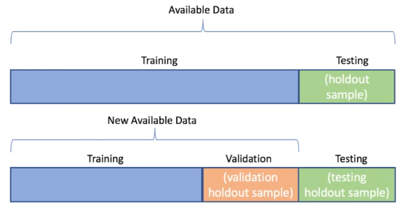
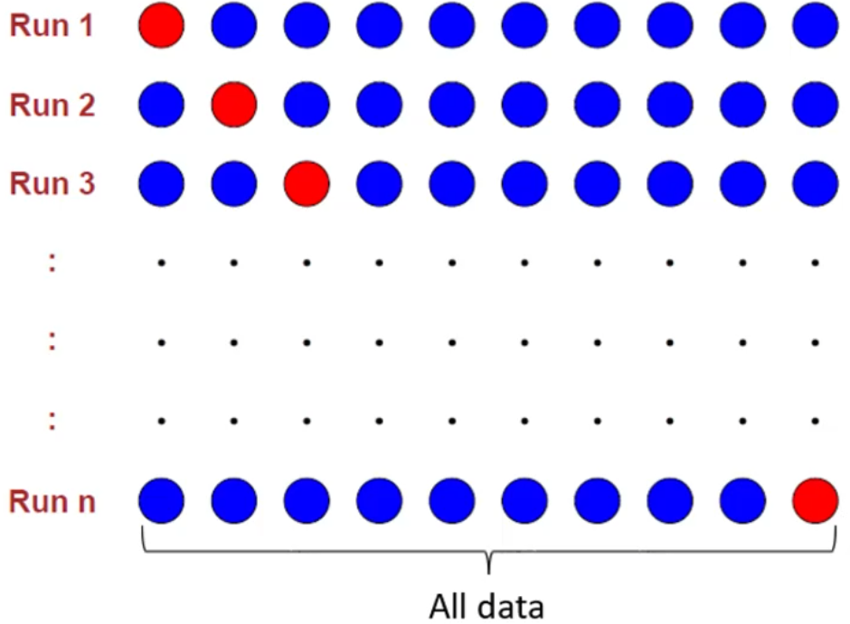
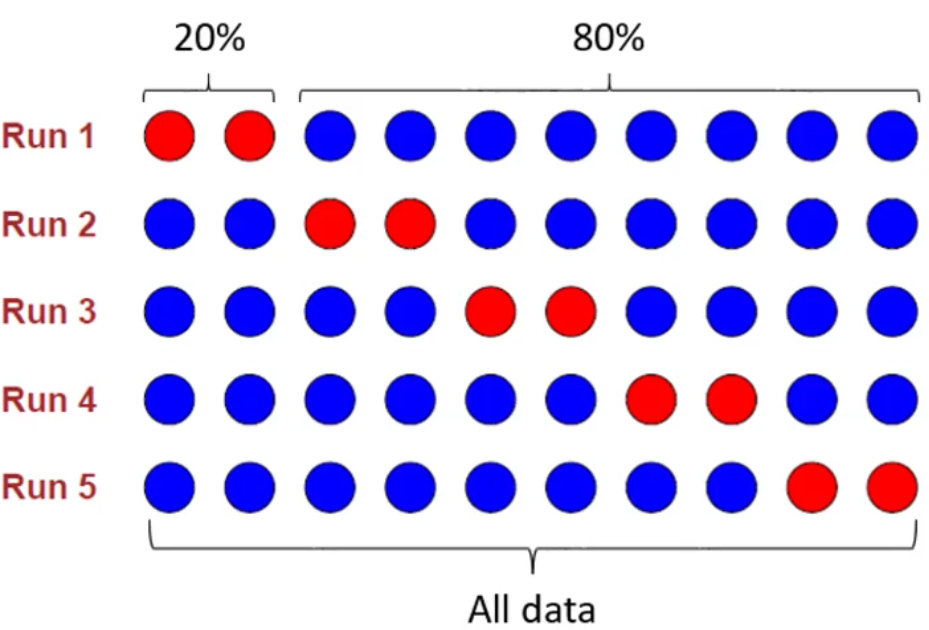
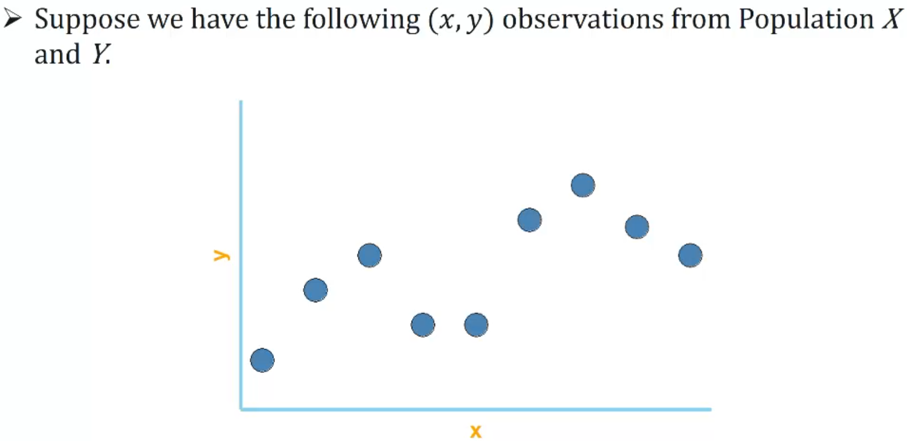
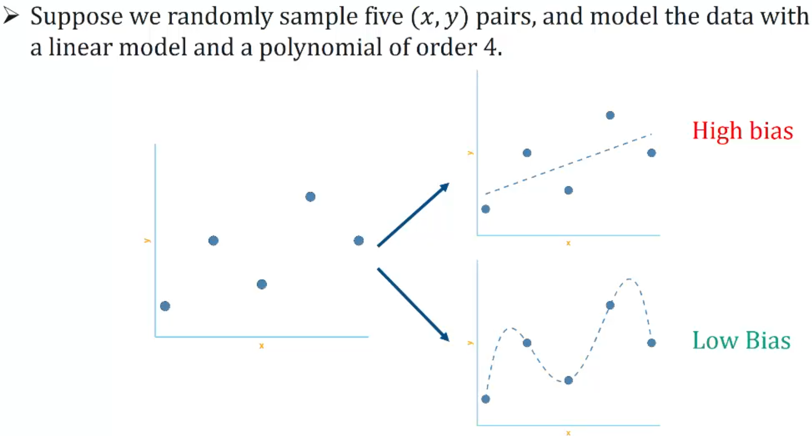

# Week 03 - Supervised learning and regression models

This week you will explore key concepts related to supervised learning as it relates to the creation of test and training sets, bias variance trade off and quality of predictions. You will also learn about [[penalised linear regression modelling]]. The objective of the week is to show you how to create predictive linear models that you can optimise, evaluate and compare.

## Learning Objectives

- apply fundamentals of supervised learning and relevant measures to compare various machine learning models
- select the appropriate modelling approach to relevant datasets
- apply appropriate modelling techniques to develop the models for regression and classification problems.

## Supervised Learning and Linear Regression

What is supervised learning? Supervised learning is a type of machine learning algorithm that uses a known dataset (called the training dataset) to make predictions. The training dataset includes input data and the corresponding output. The algorithm learns to map the input to the output and can then make predictions on new data. The algorithm is trained using a labelled dataset, meaning that the input data is paired with the correct output. The algorithm uses this dataset to learn the mapping function, which is then used to make predictions on new data.

- Supervised learning refers to a domain in machine learning that deals with predictions
- There is an outcome variable Y (Also called dependent variable or response variable or target variable).
- Y is modelled on a set of p features (Also called predictors, independent variables, inputs or covariates).
- Two types of supervised learning:
  - Regression: Y is continuous - A continuous outcome
  - Classification: Y is categorical - A categorical/qualitative outcome

### Continuous variable

temperatures = [22.1, 23.6, 21.8, 22.5]  # Temperatures in degrees Celsius

### Categorical variable

car_colors = ['Red', 'Blue', 'Green', 'Blue', 'Red']  # Colors of cars

### Quantitative variable

number_of_pets = [1, 2, 0, 3, 2]  # Number of pets individuals have

## Goals of supervised learning

- Primary goal - accurate predictions of unseen cases.
- Secondary goal - Assess the relationship between inputs and output and making statistical inferences about the relationship.
  - Difficult, if not impossible with black-box approaches like neural networks

## Training, Validation and Test Sets

- Data is split into two or three sets:
  - training set - Used to build the ML model
  - validation set - Used to tune the model
  - test sets - Used to evaluate the predictive accuracy of the ML model
- Training and test data splits - 80/20 or 75/25.
- Training and validation data - data are split systematically.

## Cross-Validation

- Cross-Validation (CV) is a technique used to assess the predictive performance of the models and to judge how they perform outside the sample to a new data set.
- It can also be used to detect overfitting of models - which is when the model is too complex and learns the detail and noise in the training data to the extent that it negatively impacts the performance of the model on new data.
- In many ML methods, CV is used for tuning the model's hyperparameters, whos values are pre-defined by the user before the learning process begins.
- CV is typically implemented in multiple rounds to ensure each sample in the dataset had a chance to be in the validation set. The end results are then combined and/or averaged to produce a single estimation.

## Leave-One-Out Cross-Validation

- Leave-One-Out Cross-Validation (LOOCV) involve using the `n-1` observations as the training set and the one remaining observation as the validation set.
- The process is repeated n number of times until each observation has been tested on

## K-Fold Cross-Validation

- The k-fold cross-validation technique involves dividing the data into k equal-sized subsets, and systematically use one subset as the testing set and use remaining k-1 subsets as the training set.
- Common k values are 4 (75/25 Split), 5 (80/20 Split), 10 (90/10 Split).

## Bias-Variance Trade-Off

- A _bias_ in ML refers to the error associated with approximating a real-world problem (e.g true population model) with a much simpler model (e.g. linear model).
- A _variance_ in ML is the amount of change in a specified training model with a different training set.
- The _bias-variance trade-off_ refers to a trade-off that ML methods undergo in an effort to minimise bias and variance.

