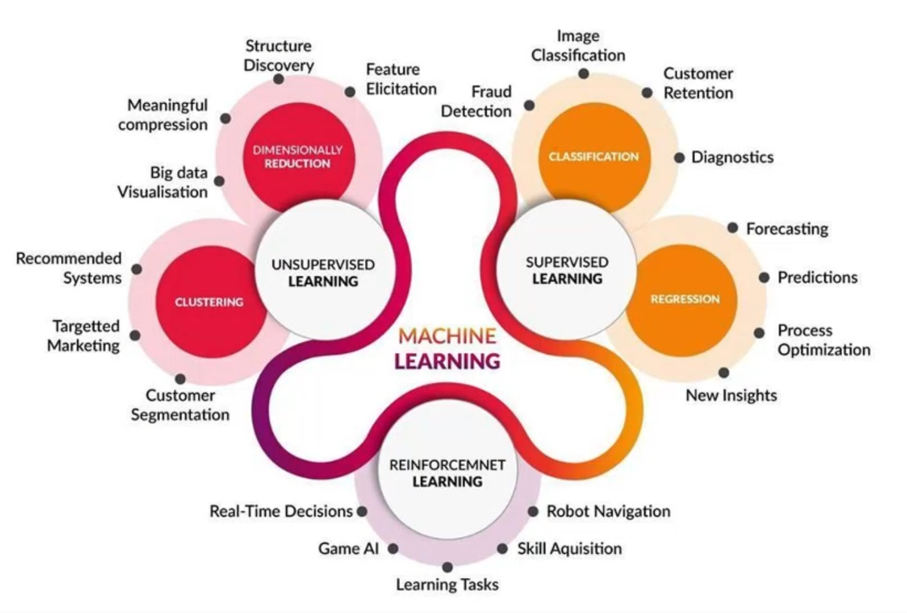
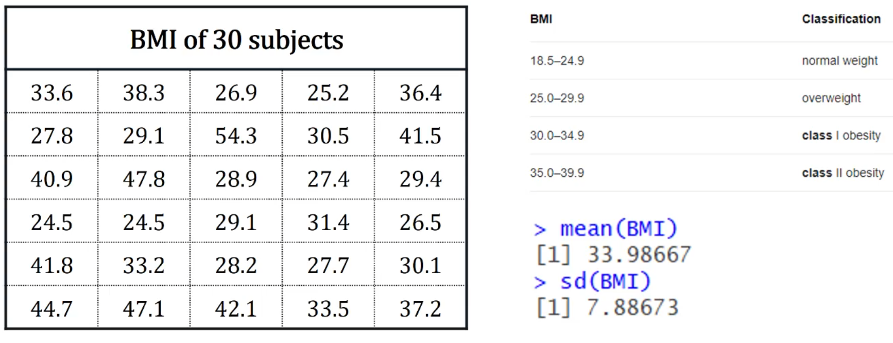

# Introduction to R and Data Visualisation

## 1.1 Intoduction to machine learning

### What is machine learning?

- A set of tools and methods that attempt to extract insights from a record of the observable world and infer patterns in data.

- Studying and understanding a phenomenon.
  - Make observations and collect relevant data.
  - Model the underlying patterns.
  - Use the model to inform our understanding of the phenomenon.
  - Make predictions.

- An important feature of any ML method is its ability to learn and improve with experience, i.e. both exsiting and new data.

- ML attempts to answer:
  - How does learning performance vary with the number of training examples?
  - Which learning algorithms are most appropriate for various types of learning tasks?

- ML draws on concepts and results from:
  - Statistics
  - Artificial intelligence
  - Philosophy
  - Information theory
  - Biology
  - Cognitive science
  - Control theory

Book reference: [[An Introduction to Statistical Learning with Applications in R]]

This unit focuses on Supervised and Unsupervised learning.

### Supervised learning

- The goal is to predict or estimate an output based on one or more inputs.
- The training data consists of a set of inputs and outputs.
- The goal is to learn a function that maps inputs to outputs.
- The function is learned from the training data.
- The function is then used to predict outputs for new inputs.
- The function is evaluated on a test set of inputs and outputs.

- Infers a function that maps set of inputs (features, predictors, covariates, independent variables) to an output (response, target, outcome, dependent variable) from input/output pairs.

- The function is inferred from training examples, which are mapped to new examples.

- Goals:

  - Accurately predict unseen cases, i.e test cases (primary)
  - Understand the relationship between inputs and outputs (secondary)

- Two sub-categories:

  - Regression: a continuous outcome
  - Classification: a categorical/qualitive outcome

### Unsupervised learning

- No distinction between inputs and outputs within a data set.
- Attempts to uncover the underlying structure or pattern within a data set.
- Can lead to testable hypothesis.
- Difficult to know how well you have done.
- Two sub-categories:
  - Clustering: group similar observations together. grouping of objects based on some similarity measure.
  - Dimension reduction: reduce the number of variables. Visualisation of multidimensional data in lower dimensions, 2-D and 3-D.

## 1.2 Introduction to data analytics

### Analysis vs Analytics?

- Analysis: the process of breaking a complex topic or substance into smaller parts to gain a better understanding of it.
- Analytics: the systematic computational analysis of data or statistics.

### What is statistics?

- statistics allow us to learn from our data by:
  - summarising the data
  - extracting patterns
  - drawing inferences
  - making predictions

- data are numbers with context.
- data contains information about some group of individuals or objects.
- A characteristic of an individual or object is called a variable.

### Data Types

Two main types of variables:

- Qualitative (categorical)
  - Nominal: no natural ordering - charateristics have no order, e.g. eye colour, gender.
  - Ordinal: natural ordering - charateristics are intrinsically ordered, e.g. education level (primary, secondary, tertiary).

- Quantitative (numerical)
  - Discrete: countable, e.g. number of children in a family. Able to take only certain distinct values within an allowable range. The alloweable range maybe finite or infinite. For example, outcome of a dice roll, number of students in a class.
  - Continuous: data measured on a scale, able to take on any values within an allowable range. which maybe finite or infinite. For example, height, weight, time, temperature.

### Exploratory Data Analysis (EDA)

- EDA is an approach to analysing data sets to summarise their main characteristics, often with visual methods.
- It is the process of describing the data and summarising the main characteristics of the data.
- Provides some insight into the behaviour of the data.
- A critical aspect of EDA is outlier detection.
- Describe graphically and numerically.

Goal is to summarise the main points of the data. how is it behaving? what is the distribution? what is the spread? what is the centre? what is the shape?.

- Graphical methods:
  - Histograms
  - Boxplots
  - Scatterplots
  - QQ plots
- Numerical methods:
  - Mean
  - Median
  - Standard deviation
  - Quantiles

### Descibing Qualitative and Discrete Data

- Qualitative and discrete (finite) data are typically expressed as count data.
- For a better perspective, counts are often expressed as proportions or percentages of the total.

|Education Level     |Count |Percent|
|--------------------|------|-------|
|Below high School   |4600  |15.33% |
|High school graduate|120000|40.00% |
|TAFE Degree         |75000 |25.00% |
|Bachelor's Degree   |50000 |16.67% |
|Post-graduate Degree|9000  |3.00%  |
|Total               |300000|100.00%|

### Describing Quantitative Data

Three Aspects are addressed

- Measures of centre: describes how data cluster around a particular value.
- Measures of spread: describes the dispeersion/variability of the data.
- Measure of shape: describes the shape of the distribution (or pattern) of the data. symmetric, skewed, bimodal, uniform. etc.

### Measure of Centre

mean - average value of the data.

- formula: $\bar{x} = \frac{1}{n} \sum_{i=1}^{n} x_i$

median (M) - middle score in the ordered data set.

- formula: $M = \frac{n+1}{2}$

mode - most frequent value in the data set. (discrete and qualitative data).

- formula: $mode = \underset{x}{\operatorname{argmax}} \sum_{i=1}^{n} I(x_i = x)$

### Measure of Spread (Variability)

variance - measures how spread out the data points are from their mean.

formula: $s^2 = \frac{1}{n-1} \sum_{i=1}^{n} (x_i - \bar{x})^2$

standard deviation (s) - is the average offset of each data point from its mean. it is calculated as the square root of variance. it is the most commonly used measure of spread.

formula: $s = \sqrt{\frac{1}{n-1} \sum_{i=1}^{n} (x_i - \bar{x})^2}$

Mean = 33.98667
sd(BMI) = 7.88673

|BMI|Classification|
|---|--------------|
|18.5 - 24.9|Normal weight|
|25.0 - 29.9|Overweight|
|30.0 - 34.9|Obesity class I|
|35.0 - 39.9|Obesity class II|

just by looking at the mean bmi, we can see the average person is in the obese class I category. but the standard deviation is quite large, so there is a lot of variability in the data. the mean is not a good measure of centre in this case.

One way to asses if we have variable data is to divide the standard deviation by the mean. e.g $\frac{sd}{mean} = \frac{7.88673}{33.98667} = 0.232$ which in a percentage is 23.2%. this is a large percentage, so we have a lot of variability in the data.

**13:28. 17/01/2024**